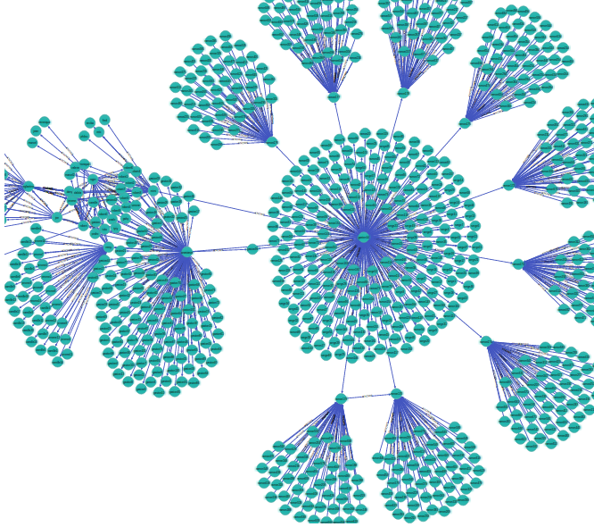
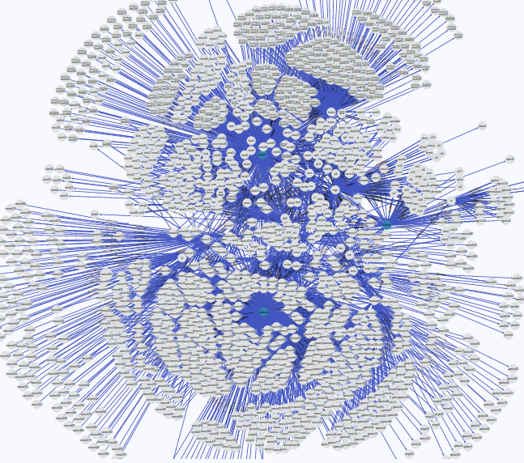

## Exemples
You can try our examples on [the neo4j amazing console](http://console.neo4j.org/). Just copy-paste our examples on it.
### Create the graph
```
create (facebook:Social {nom:"facebook"})
create (twitter:Social {nom:"twitter"})
create (linkedin:Social {nom:"linkedin"})

create (roger:Personne {nom:"roger"})
create (roger)-[:INSCRIT]->(facebook)

create (mimi:Personne {nom:"mimi"})
create (mimi)-[:INSCRIT]->(facebook)

create (roger)-[:COUPLE]->(mimi)
```

### Request the graph
```
MATCH (roger:Personne { nom:"roger" })-[:COUPLE]-(mimi:Personne {nom:"mimi"})
RETURN roger, mimi
```

## Notes :
### Bi-Directional Relationships
Certain relationships are implicitly bi-directional, such as the KNOWS relationship we created in the example where there are two relationships between Jack and Jill. In these cases it can provide read query flexibility, but adds additional write load and requires more maintenance to have both. Much of this strategy will come down to your use case, but when possible I’ve found it easier to only create one relationship and always MATCH without direction specified to detect its existence for relationships that are implicitly bi-directional where there is no variation between INCOMING and OUTGOING relationships.

## With given data
### Convert the data into neo4j queries
```
python3 graph_creator.py
```
Will generate a hello.txt file containing each single command to launch on neo4j.

### To use the online console neo4j
#### Method 1 : manual
Paste manually the content of each file in outputNeo4jConsole. Execute the query before paste another file. (StackOverFlow error otherwise because of the quantity of data...). This method does not work with the queries of matching. You have to copy-paste one by one (very long)

#### Method 2 : automatically
Open a terminal in social_graph/ToGraph folder.
Configure the script
```
chmod +x exportToNeo4j.sh
```
Open the console neo4j in a tab on your webbrowser.
Toggle visualisation
Clean the default database by pressing the clean button
Select the text of the query tab
At this moment, do not use your mouse anymore
press ctrl + v and find your terminal
(by pressing ctrl + v you have to switch between your terminal and your webbrowser)
execute the following script
```
./exportToNeo4j.sh hello.txt
```
Be patient
Toggle again the visualisation

#### Result with facebook
You should get a graph like :


#### Result with our three social networks
We execute our scripts on the available data. The database is accessing following this [link](http://console.neo4j.org/r/z9o4nf) (because of the large amount of data, the heroku server from neo4j is crashing... All the graph is save for you into the output_graph_request.neo4j file). Here is the graph combining facebook, google+ and linkedin :

